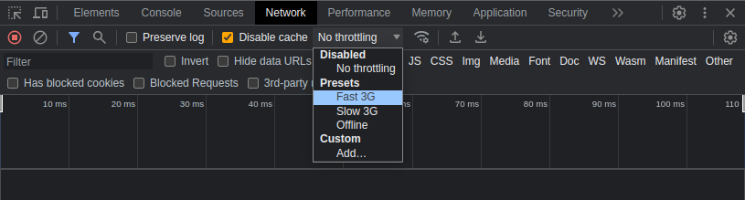
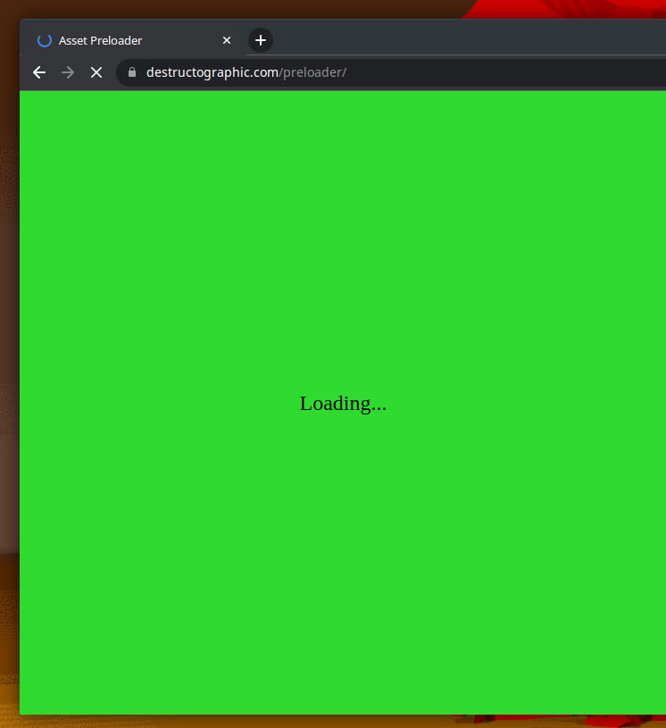

# preloader.js

### Preload image and sound assets via JS.
  
Place desired assets to be preloaded into the `assetsForPreload` array. When the page is initially loaded, the `curtain` div will be displayed, covering up all content in the viewport. This `curtain` will remain in place while the `assetsForPreload` array is loaded. Upon completion `curtain` div will hide to reveal the underlaying content. For purposes of this demo, the under lying content resides in a div called `main-content`.
   
Live demo [here](https://destructographic.github.io/preloader/).
For demonstration purposes this repository has a few images to load. Most likely your internet connection is too fast though and you may not even see the loading screen. To solve this problem, use your browser's developer tools to temporarily disable cache and simulate a slower connection (aka throttle). In Chrome/Chromium browser throttling can be accomplished as pictured below.    

	1. Open your browser's developer tools (usually F12 button). Click "Network". 
      
	2. Disable cache and select a slower connection such as "Good 3G":  
      
  3. Press reload (usually F5 button or Ctrl+R / Cmd +R).  
  

